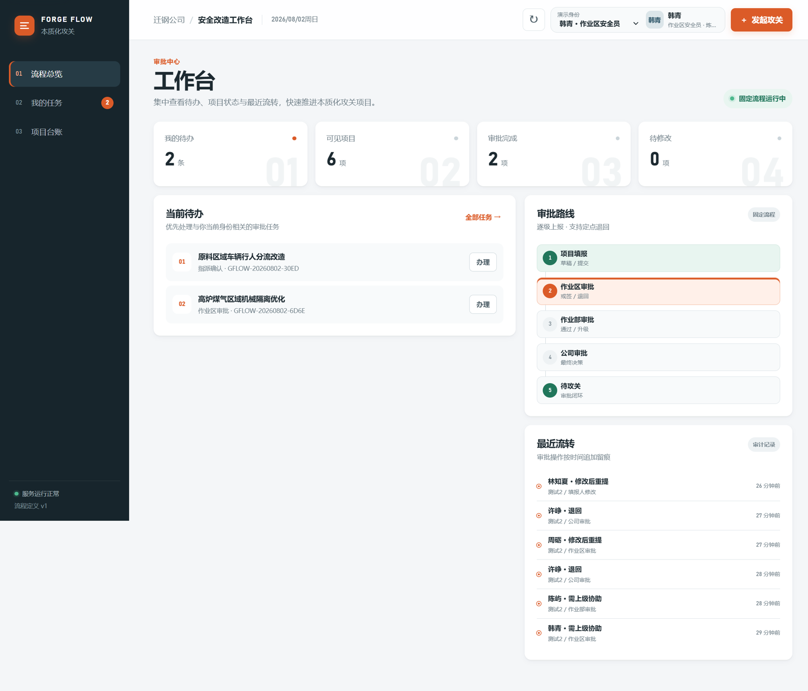
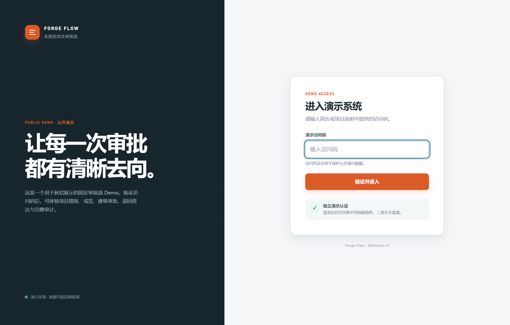
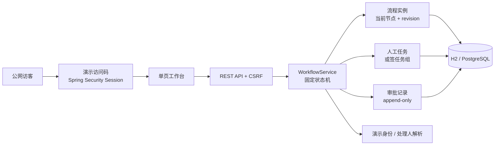
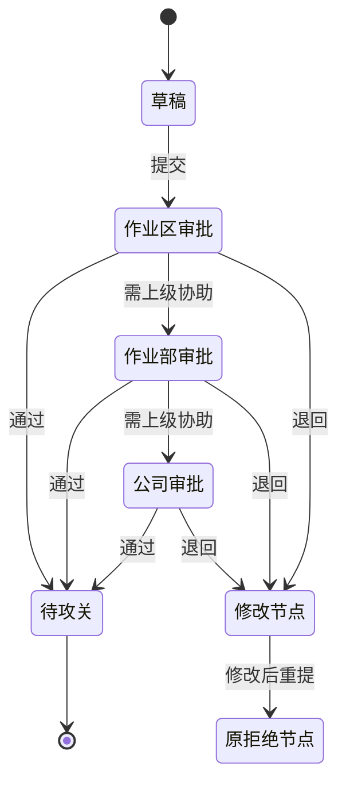

# Forge Flow · 本质化攻关审批流 Demo

一个面向秋招展示的轻量固定审批流系统。它不是 BPMN 平台，而是从真实企业安全攻关场景中提炼出的领域状态机，重点展示人工任务、或签、逐级审批、退回直达、任务权限和追加式审计。





## 一分钟了解项目

- **业务闭环**：项目草稿 → 作业区审批 → 作业部审批 → 公司审批 → 待攻关。
- **逐级升级**：非最高级节点可选择“需上级协助”，把流程推进至上一级。
- **或签**：作业区两名安全员均收到任务，任意一人办理后，同组其他任务自动失效。
- **退回直达**：公司可退回到填报人、作业区或作业部；修改后直接回到原拒绝节点。
- **指派流程**：跨部门指派直接进入目标作业区确认。
- **并发保护**：任务条件更新与流程实例 `revision` 双重保护，避免重复审批。
- **幂等操作**：每次任务处理携带 `operationId`，重复请求不重复写历史。
- **完整审计**：审批记录 INSERT-only，并使用实例内递增序号保证时间线稳定。
- **公开演示保护**：共享访问码、Session、CSRF 与未登录 API `401`，认证和流程角色彼此独立。
- **自动恢复基线**：Docker 部署每天凌晨事务化重建演示业务数据，避免公开访客长期污染 Demo。
- **开箱即用**：内置 6 个演示身份和 4 个不同阶段的示例项目。

## 技术栈

- Java 21
- Spring Boot 4.1
- Spring Web / Spring Data JPA / Spring Security / Bean Validation
- H2（本地零配置）
- PostgreSQL（Docker 部署）
- 原生 HTML、CSS、JavaScript（无前端构建依赖）
- JUnit 5 / AssertJ

选择原生前端不是为了省略工程质量，而是为了把部署单元控制为一个 JAR，降低秋招现场演示的不确定性。

## 架构



核心对象的职责保持分离：

| 对象 | 职责 |
| --- | --- |
| `Project` | 攻关课题、填报人、业务状态等业务数据 |
| `WorkflowInstance` | 流程定义版本、当前节点、退回恢复节点、乐观锁版本 |
| `ApprovalTask` | 当前谁可以办理、任务组、完成/失效状态 |
| `ApprovalRecord` | 谁在什么节点执行了什么动作，永不修改历史 |
| `DemoUser` | 用于展示角色、组织和处理人解析 |

## 固定流程



“退回”是一次新的业务状态迁移，不是数据库回滚。历史审批记录不会删除，重提会创建目标节点的新任务。

## 本地运行

要求：JDK 21+、Maven 3.9+。

```bash
mvn spring-boot:run
```

打开 [http://localhost:8080](http://localhost:8080)。本地使用文件型 H2 数据库，数据保存在 `./data`。

本地默认演示访问码为 `forge-demo`。也可以在启动前设置环境变量覆盖：

```powershell
$env:DEMO_ACCESS_CODE="你的演示访问码"
mvn spring-boot:run
```

运行测试：

```bash
mvn test
```

测试覆盖：

- 或签首位办理人获胜，兄弟任务自动取消。
- 公司退回至作业区，修改后直达公司节点。
- 相同 `operationId` 重放不会重复写审批历史。
- 定时恢复只替换流程业务数据，并重新生成完整的四项目演示基线。

## Docker 部署

要求：Docker 与 Docker Compose。

```bash
cp .env.example .env
# 编辑 .env，设置随机的 DEMO_ACCESS_CODE 和 DB_PASSWORD
docker compose up -d --build
```

Compose 会启动应用与 PostgreSQL，并等待数据库健康后再启动应用。为避免绕过公网防护，应用只绑定到服务器本机的 `127.0.0.1:8080`，应通过同机 Nginx/Caddy 或 Cloudflare Tunnel 暴露 HTTPS 域名。

Docker 环境默认每天北京时间 `04:00` 恢复演示基线。恢复过程只替换项目、流程实例、审批任务和审批记录，不删除演示身份、登录配置或数据库结构；清理和重新生成位于同一事务中，失败时会整体回滚。可以在 `.env` 中调整：

```dotenv
DEMO_RESET_ENABLED=true
DEMO_RESET_CRON=0 0 4 * * *
DEMO_RESET_ZONE=Asia/Shanghai
```

应用使用 Spring Cron（包含秒字段），上面的表达式表示每天 `04:00:00`。如需临时保留访客数据，将 `DEMO_RESET_ENABLED` 设置为 `false` 并重启应用容器。

停止服务：

```bash
docker compose down
```

如需同时删除演示数据库卷：

```bash
docker compose down -v
```

> `down -v` 会删除演示数据，执行前请确认不需要保留当前演示过程。

## 公网演示安全边界

当前实现适合秋招公开 Demo：访问者先输入一个共享访问码，认证成功后才能加载页面和操作 API；页面中的六个角色只是流程模拟身份，不是登录账号。访问码通过 `DEMO_ACCESS_CODE` 注入，不进入代码仓库；Session 默认 30 分钟，Docker 环境使用 `Secure`、`HttpOnly`、`SameSite=Lax` Cookie，所有写请求保留 CSRF 防护。

登录限制可以阻止匿名用户污染数据，但**不能单独抵御 DDoS**。公网部署还必须满足：

1. 域名开启 Cloudflare 代理或使用云厂商的 DDoS/WAF 服务。
2. 不直接开放服务器的 8080 端口；仅允许 HTTPS 反向代理访问应用。
3. 在边缘层限制 `/login` 的请求频率，例如单 IP 每分钟 5 次。
4. 使用随机长访问码和独立数据库密码，并定期更换。
5. 保持每日演示基线恢复开启；紧急情况下仍可停止服务后使用 `docker compose down -v` 完整重建数据库卷。

如果通过纯 HTTP 在本机测试 Docker，可在 `.env` 中临时设置 `SESSION_COOKIE_SECURE=false`；公网环境必须保持 `true`。

## 演示身份

| 身份 | 角色 | 推荐演示动作 |
| --- | --- | --- |
| 林知夏 | 作业部员工 | 创建草稿、提交上报项目、处理退回修改 |
| 周砺 / 韩青 | 作业区安全员 | 演示或签、通过、需上级协助、退回 |
| 陈屿 | 作业部安全员 | 通过或继续申请公司协助 |
| 许峥 | 公司安全员 | 最终审批、跨层级退回 |
| 沈念 | 职能部员工 | 发起跨部门指派项目 |

页面顶部可以直接切换身份。该方式只用于模拟不同流程办理人；真正的公网访问限制由 Spring Security 演示访问码负责。

## 推荐面试演示脚本

1. 使用“林知夏”创建逐级上报项目并提交。
2. 切换到“周砺”，说明作业区节点为或签，并选择“需上级协助”。
3. 切换到“陈屿”，继续申请公司协助。
4. 切换到“许峥”，将项目退回作业区并填写原因。
5. 切换回“周砺”，修改后重新提交。
6. 展示项目直接回到公司审批，而不是重新从作业区逐级流转。
7. 打开项目详情，展示稳定有序、不可覆盖的审批时间线。

## 关键 API

| 方法 | 路径 | 说明 |
| --- | --- | --- |
| `GET` | `/api/users` | 获取演示身份 |
| `GET` | `/api/dashboard` | 当前身份工作台 |
| `POST` | `/api/projects` | 创建项目草稿 |
| `POST` | `/api/projects/{id}/submit` | 提交草稿 |
| `GET` | `/api/tasks?view=todo` | 当前身份待办 |
| `POST` | `/api/tasks/{id}/complete` | 完成任务并推进流程 |
| `GET` | `/api/projects/{id}` | 项目、运行态与审批时间线 |

`/api/meta` 和 `/api/csrf` 可匿名访问，其余接口需要先完成演示认证。业务请求使用 `X-Demo-User` 标识当前模拟角色；所有 POST 请求还必须携带 CSRF Token。

## 简历描述参考

> 设计并实现本质化攻关项目轻量审批流系统，基于有限状态机支持多级审批、或签、上级协助、指定节点退回、直达重提及跨部门指派；通过任务条件更新、流程实例乐观锁和请求幂等解决并发审批，通过追加式审批日志实现完整审计，并使用 Docker Compose 完成单机部署。

## Demo 边界

为了保持项目轻量，当前明确不包含：

- BPMN XML 解析与拖拽设计器。
- 真实 SSO、多账号用户体系和企业级数据权限。
- 企业微信、组织中心等外部系统接入。
- 并行网关、子流程、运行中定义迁移。
- 攻关实施、验收和亮点评星阶段。

如果用于生产，应增加正式认证授权、数据库迁移工具、可靠通知 Outbox、操作审计脱敏和监控告警。
